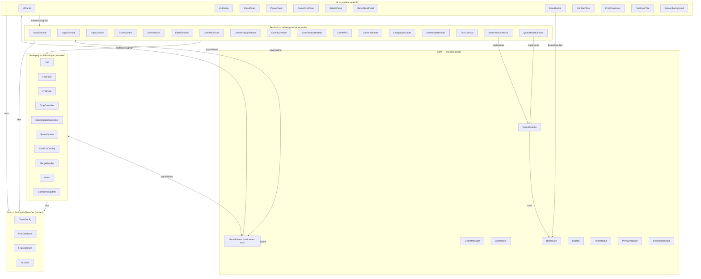
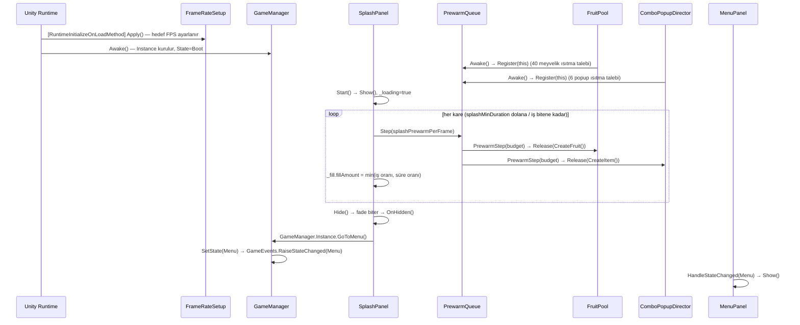
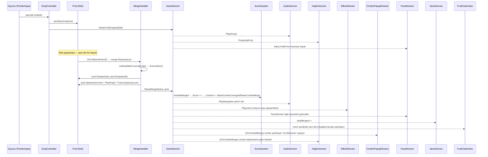
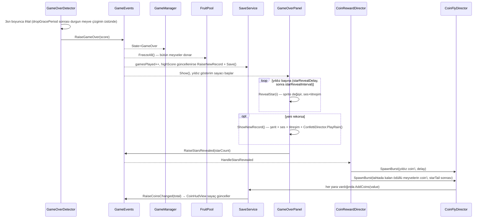
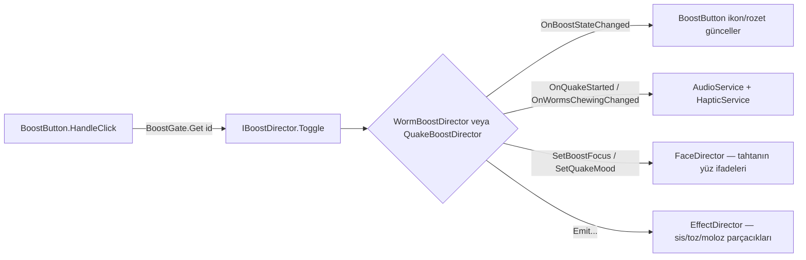

# FruitMerge — Kod Mimarisi

Bu doküman `Assets/FruitMerge` altındaki tüm C# scriptlerini, bunların sahnedeki (`Game.unity`) hangi GameObject'e bağlı olduğunu, birbirleriyle nasıl konuştuğunu ve her scriptin/fonksiyonun ne işe yaradığını anlatır. Otomatik üretildi: sahne dosyası (37.603 satır YAML) ayrıştırılıp gerçek component/GameObject eşleşmeleri çıkarıldı, ardından `Assets/FruitMerge/Scripts` ve `Assets/FruitMerge/Editor` altındaki **45 script**'in tamamı tek tek okunarak analiz edildi.

> Not: `Assets/Plugins/Demigiant/DOTween` pakedi projede duruyor ama hiçbir FruitMerge scripti onu **kullanmıyor** (hiçbir yerde `using DG.Tweening` yok). Tüm animasyonlar elle `Mathf.Lerp` / `Time.deltaTime` ile yazılmış. Benzer şekilde `com.unity.inputsystem` paketi kurulu ama sadece **UI event modülü** (`EventSystem` + `InputSystemUIInputModule`) için kullanılıyor; oynanış girdisi (meyve bırakma, boost hedefleme) hâlâ eski `UnityEngine.Input` API'sinden okunuyor (bkz. [`PointerInput`](#pointerinput)).

---

## 1. Genel Bakış

FruitMerge, Suika/2048-tarzı bir "merge" (birleştirme) oyunu: oyuncu meyveleri bir kutuya bırakır, aynı meyveler çarpışınca bir üst tiere birleşir, kutu dolarsa oyun biter. Unity **URP 2D** üzerine kurulu, UI tarafı **UGUI + TextMeshPro**.

**Katmanlar** (`Assets/FruitMerge/Scripts` altındaki klasörler):

| Klasör | Sorumluluk | Script sayısı |
|---|---|---|
| `Core` | Oyun durumu, merkezi event bus, girdi okuma, boost altyapısı | 9 |
| `Data` | Saf veri — `ScriptableObject` tanımları (meyveler, ayarlar, yüzler) | 4 |
| `Gameplay` | Fiziksel/görsel oyun nesneleri (meyve, kurt, birleşme mantığı) | 10 |
| `Services` | Sahne genelinde tek örnek çalışan yönetmenler (ses, titreşim, kamera, efekt, kayıt, boost'lar) | 17 |
| `UI` | Paneller ve HUD bileşenleri | 12 |
| `Editor` | Yalnızca Unity Editor'de çalışan araçlar (derlemeye girmez) | 4 |

**Temel mimari prensip:** Sistemler birbirini neredeyse hiç doğrudan çağırmaz. Bunun yerine hepsi tek bir statik olay merkezine ([`GameEvents`](#gameevents)) abone olur/yayın yapar. Bir `MonoBehaviour`'un ihtiyaç duyduğu tekil servislere (havuz, ses, kayıt vb.) erişimi ise `Instance` (singleton) alanları üzerinden olur. Bu iki mekanizma dışında Inspector'dan sürüklenen doğrudan referanslar da var (özellikle `GameConfig` gibi salt-okunur veri varlıkları için).

---

## 2. Katman / Bağımlılık Diyagramı



`GameEvents` bilerek diyagramın merkezinde: neredeyse her sistem ona bağlı, ama sistemler birbirinin somut tipini bilmiyor. Bunun tek istisnaları: (a) `Instance` singleton'lar üzerinden yapılan doğrudan servis çağrıları (ör. `AudioService.Instance.PlayDrop()`), (b) Inspector'dan sürüklenen `GameConfig`/`FruitDatabase` referansları, (c) `BoostGate` üzerinden `IBoostDirector` arayüzüne yapılan dolaylı çağrılar.

---

## 3. Merkezi Sinir Sistemi: `GameEvents` {#gameevents}

**Dosya:** `Scripts/Core/GameEvents.cs` · **Tür:** `static class` (GameObject'e bağlı değil, sahnede hiçbir yerde durmaz)

Projenin tamamı bu tek dosya üzerinden konuşuyor. 21 tane `public static event Action<...>` alanı var, her biri için bir `RaiseX(...)` metodu var (`OnMerged` → `RaiseMerged(...)` gibi). `[RuntimeInitializeOnLoadMethod]` ile işaretli `ResetStatics()` metodu, Unity'nin "domain reload kapalı" modunda statik alanların bir önceki Play oturumundan kalmasını engelliyor — her yeni oturumda tüm event'ler `null`'a sıfırlanıyor.

Aşağıdaki tablo **her event için gerçek kod taramasıyla çıkarılan** yayınlayan/dinleyen listesidir (tahmini değil — `grep` ile doğrulandı):

| Event | Yayınlayan (`Raise...`) | Dinleyenler | Anlamı |
|---|---|---|---|
| `OnMerged` | `MergeHandler.Execute` | `AudioService`, `EffectDirector`, `FaceDirector`, `SaveService`, `ScoreSystem`, `FruitChainView` | İki aynı meyve birleşip bir üst tier doğdu |
| `OnMaxTierMerged` | `MergeHandler.Execute` (bir üst tier yoksa, yani karpuz+karpuz) | `AudioService`, `EffectDirector`, `FaceDirector`, `ScoreSystem`, `ConfettiDirector`, `HapticService`, `FruitChainView` | Zincirin son halkası birleşti, iki meyve de yok oldu |
| `OnFruitDropped` | `DropController.Drop` | `AudioService`, `HapticService`, `FaceDirector` | Oyuncu parmağını bıraktı, meyve fiziğe teslim edildi |
| `OnNextFruitChanged` | `SpawnQueue.Next` | `HUDView` | Sıradaki meyve değişti (önizleme güncellensin) |
| `OnScoreChanged` | `ScoreSystem` | `HUDView` | Skor değişti |
| `OnHighScoreChanged` | `SaveService` (açılışta ve yeni rekorda) | `HUDView` | Rekor değişti/yüklendi |
| `OnComboChanged` | `ScoreSystem` | *(şu an dinleyen yok)* | Combo sayacı değişti — kodda yayınlanıyor ama hiçbir sistem henüz dinlemiyor; ileride bir combo göstergesi için ayrılmış görünüyor |
| `OnComboMerge` | `ScoreSystem.HandleMerged` | `ComboPopupDirector`, `HapticService` | Nitelikli birleşme: üretilen meyve + konum + o anki combo BİR ARADA (sıra garantisi gerektirmeden) |
| `OnStateChanged` | `GameManager.SetState` | `DropController`, `CoinFlyDirector`, `ConfettiDirector`, `GameOverDetector`, `MenuPanel`, `PausePanel`, `GameOverPanel`, `BoostShopPanel`, `CoinHudView`, `WormBoostDirector`, `QuakeBoostDirector`, `FaceDirector`, `HapticService`, `BoostButton` | `GameState` değişti (Boot/Menu/Playing/Paused/GameOver) |
| `OnGameOver` | `GameOverDetector.Update` | `GameManager`, `FruitPool`, `AudioService`, `SaveService`, `FaceDirector`, `GameOverPanel`, `HapticService` | Kayıp sayacı doldu, oyun bitti |
| `OnSettingsChanged` | `SaveService` (Sfx/Music/Vibration set edilince) | `AudioService`, `HapticService` | Ses/müzik/titreşim ayarı değişti |
| `OnRunStarted` | `GameManager.StartNewRun` | `DropController`, `ScoreSystem`, `EffectDirector`, `ComboPopupDirector`, `ConfettiDirector`, `CoinFlyDirector`, `GameOverDetector`, `HUDView`, `GameOverPanel`, `FruitChainView`, `WormBoostDirector`, `QuakeBoostDirector`, `HapticService` | YENİ bir oyun başladı (Pause'dan dönüş DEĞİL) — tahtayı/skoru sıfırlama sinyali |
| `OnNewRecord` | `SaveService.HandleGameOver` | `GameOverPanel` | Bu oyunda rekor kırıldı |
| `OnBoostStateChanged` | `WormBoostDirector`, `QuakeBoostDirector` | `BoostButton` | Bir boost'un durumu değişti (silahlı mı, kaç kullanım kaldı) |
| `OnBoostShopRequested` | `BoostButton.HandleClick` (kullanım bittiyse) | `BoostShopPanel` | Oyuncu kullanımı biten bir boost'a bastı → mağaza açılmalı |
| `OnBoostShopToggled` | `BoostShopPanel.OnShow/OnHide` | `CoinHudView` | Mağaza paneli açıldı/kapandı |
| `OnCoinsChanged` | `SaveService` (AddCoins/TrySpendCoins/Start) | `CoinHudView`, `BoostShopPanel` | Cüzdan toplamı değişti |
| `OnStarsRevealed` | `GameOverPanel.OnTick` (yıldızlar dolduktan sonra) | `CoinRewardDirector` | Sonuç ekranındaki yıldız gösterimi bitti → coin ödülü akabilir |
| `OnFruitEaten` | `WormBoostDirector.VanishFruit` | `HapticService` | Kurtçuklar bir meyveyi yuttu |
| `OnQuakeStarted` | `QuakeBoostDirector.Begin` | `AudioService`, `HapticService` | Deprem boost'u başladı |
| `OnWormsChewingChanged` | `WormBoostDirector` | `HapticService` | Kurtçukların çiğneme SÜRECİ başladı/bitti (tek anlık olay değil) |

---

## 4. Sahne Hiyerarşisi (`Assets/FruitMerge/Scenes/Game.unity`)

Sahnede **164 GameObject** var. Aşağıda hangi GameObject'in hangi script'i (component) taşıdığı, gerçek sahne verisinden çıkarılmış hâliyle gösteriliyor. Unity'nin kendi yerleşik bileşenleri (`Button`, `Image`, `TextMeshProUGUI`, `Canvas`, `CanvasScaler`, `GraphicRaycaster`, `EventSystem`, `LayoutElement`, `HorizontalLayoutGroup` vb.) parantez içinde kısaltılmadan **UI** olarak belirtildi; asıl ilgi alanımız FruitMerge'e ait scriptler.

### 4.1 Kök seviye — Yönetmenler / Singleton'lar (sahnenin üst düzeyinde, hepsi kardeş)

```
Game.unity (root objeler)
├─ SaveService              → SaveService
├─ AudioService              → AudioService
├─ ComboPopupDirector        → ComboPopupDirector
├─ ConfettiDirector          → ConfettiDirector
├─ EventSystem               → (Unity) EventSystem + InputSystemUIInputModule
├─ Gameplay                  (boş konteyner)
│   ├─ DropZone               → DropController
│   │   ├─ PendingFruit        (boş konteyner — bekleyen meyve burada parent'lanır)
│   │   ├─ DropIndicator       → SpriteRenderer + DropIndicatorController
│   │   ├─ DropperBranch       → SpriteRenderer (dal görseli)
│   │   └─ NextFruit           → SpriteRenderer + NextFruitDisplay
│   │       └─ Face             → SpriteRenderer (önizlemenin yüzü)
│   └─ ActiveFruits            (boş konteyner — düşen/yerleşen meyvelerin parent'ı, FruitPool._activeParent)
├─ EffectDirector            → EffectDirector
│   ├─ JuiceDroplets           → ParticleSystem (ana meyve suyu)
│   ├─ JuiceMist               → ParticleSystem (ince serpinti)
│   ├─ EatSmoke                → ParticleSystem (kurtçuk sisi)
│   ├─ QuakeDust               → ParticleSystem (deprem tozu)
│   └─ QuakeRubble             → ParticleSystem (deprem molozu)
├─ MainCanvas                 → (Unity) Canvas + CanvasScaler + GraphicRaycaster   ── bkz. §4.2
├─ GameManager                → GameManager
├─ SpawnQueue                 → SpawnQueue
├─ Environment                (boş konteyner)
│   ├─ Background              → SpriteRenderer + BackgroundCover
│   ├─ Container                (boş konteyner)
│   │   ├─ Wall_Left             → BoxCollider2D
│   │   ├─ Wall_Right            → BoxCollider2D
│   │   └─ Wall_Bottom           → BoxCollider2D
│   └─ DangerLine               → SpriteRenderer + GameOverDetector
├─ QuakeBoostDirector        → QuakeBoostDirector
├─ MergeHandler               → MergeHandler
├─ CoinFlyDirector            → CoinFlyDirector
├─ Main Camera                → Camera + AudioListener + UniversalAdditionalCameraData(URP) + CameraShaker + CameraFit
├─ ScoreSystem                → ScoreSystem
├─ HapticService              → HapticService
├─ FruitPool                  → FruitPool
├─ FaceDirector               → FaceDirector
├─ WormBoostDirector          → WormBoostDirector
├─ Pool                       (boş konteyner)
│   ├─ PooledFruits             (boş konteyner — FruitPool._pooledParent, deaktif meyveler burada bekler)
│   └─ ComboPopups              (boş konteyner — ComboPopupDirector._parent)
└─ CoinRewardDirector        → CoinRewardDirector
```

### 4.2 `MainCanvas` alt ağacı — UI hiyerarşisi

`MainCanvas` üç alt Canvas'a bölünmüş (hepsi **Screen Space – Overlay**, farklı `sortOrder`): `HUDCanvas` (0, oynanış HUD'u) → `PanelCanvas` (2, tam ekran paneller) → `OverlayCanvas` (3, panellerin bile üstünde — cüzdan, uçan paralar, konfeti).

```
MainCanvas                    → Canvas + CanvasScaler(Match=1, sadece yükseklik) + GraphicRaycaster
├─ HUDCanvas                   → Canvas + HUDView
│   ├─ PauseButton              → Button
│   │   └─ Icon                  → Image
│   ├─ HudPanel                 → Image (arkaplan)
│   │   ├─ ScoreText             → TextMeshProUGUI   (HUDView._scoreText)
│   │   └─ HighScoreText         → TextMeshProUGUI   (HUDView._highScoreText)
│   ├─ FruitChainPanel          → FruitChainView + HorizontalLayoutGroup + Image
│   │   └─ Slot_00 … Slot_10      (11 slot, tier sırasıyla) → LayoutElement
│   │       └─ Icon                → Image  (FruitChainView._fruitIcons[i])
│   │           └─ Face              → Image  (FruitChainView._faceIcons[i])
│   ├─ BoostSlot                → BoostButton(_id=Worms) + CanvasGroup + Button + Image
│   │   ├─ Glow                   → Image  (_armedGlow)
│   │   ├─ CountBadge             → Image
│   │   │   └─ Label                → TextMeshProUGUI
│   │   └─ PlusBadge              → Image
│   └─ BoostSlot_Quake          → BoostButton(_id=Quake) + CanvasGroup + Button + Image  (yapısı BoostSlot ile birebir aynı)
├─ PanelCanvas                 → Canvas
│   ├─ GameOverPanel            → GameOverPanel + CanvasGroup
│   │   ├─ Dimmer                 → Image (tam ekran karartma)
│   │   └─ Box                    → Image
│   │       ├─ Title                → FruitColorTitle + TextMeshProUGUI
│   │       ├─ ScoreCaption         → TextMeshProUGUI
│   │       ├─ ScoreLabel           → TextMeshProUGUI  (GameOverPanel._scoreLabel)
│   │       ├─ BestCaption          → TextMeshProUGUI
│   │       ├─ BestLabel            → TextMeshProUGUI  (GameOverPanel._bestLabel)
│   │       ├─ RestartButton        → Button + Image
│   │       ├─ Stars                (boş konteyner)
│   │       │   ├─ Star1 / Star2 / Star3 → Image  (GameOverPanel._stars[0..2])
│   │       ├─ NewRecordRibbon      → Image  (GameOverPanel._newRecordRibbon, başta gizli)
│   │       └─ MenuButton           → Button + Image
│   ├─ PausePanel               → PausePanel + CanvasGroup
│   │   ├─ Dimmer / Box → HeaderRibbon/Title, CloseButton
│   │   ├─ Settings               (boş konteyner)
│   │   │   ├─ SfxButton            → Button  (+ SfxIcon)
│   │   │   ├─ MusicButton          → Button  (+ MusicIcon)
│   │   │   └─ VibrationButton      → Button  (+ VibrationIcon)
│   │   ├─ ResumeButton           → Button
│   │   ├─ RestartButton          → Button
│   │   └─ MenuButton             → Button
│   ├─ MenuPanel                → MenuPanel + CanvasGroup
│   │   ├─ Background             → Image + ScreenBackground
│   │   ├─ Cloud1..4              → Image (dekor)
│   │   ├─ FruitPile              → Image (dekor)
│   │   └─ PlayButton             → Button  (MenuPanel._playButton)
│   ├─ SplashPanel              → SplashPanel + CanvasGroup
│   │   ├─ Background             → ScreenBackground + Image
│   │   ├─ Decor / Logo           → Image
│   │   └─ LoadingBar             (boş konteyner)
│   │       ├─ Track                → Image
│   │       └─ Fill                 → Image (Image Type=Filled — SplashPanel._fill)
│   └─ BoostShopPanel           → BoostShopPanel + CanvasGroup
│       ├─ Dimmer / Box → CloseButton, BoostIcon, Description, BuyButton
│       │   └─ BuyButton            → Button
│       │       ├─ CoinIcon           → Image
│       │       └─ PriceLabel         → TextMeshProUGUI
└─ OverlayCanvas               → Canvas  (sortOrder en yüksek — her şeyin üstünde)
    ├─ CoinHud                  → CoinHudView + CanvasGroup
    │   ├─ Badge                  → Image
    │   ├─ CoinAnchor             → Image  (uçan paraların vardığı hedef — CoinFlyDirector._target)
    │   └─ Label                  → TextMeshProUGUI  (CoinHudView._label)
    ├─ CoinFxFront              (boş konteyner — CoinFlyDirector._layer, uçan para Image'ları burada koddan yaratılır)
    └─ ConfettiFx               (boş konteyner — ConfettiDirector._layer, konfeti parçaları burada koddan yaratılır)
```

> **Not — koddan yaratılan objeler:** `CoinFxFront`, `ConfettiFx`, `Pool/PooledFruits` altındaki asıl içerik ve boost'ların nişangâh/kurt objeleri **sahne dosyasında görünmez** çünkü `Awake()`/`Start()` sırasında `new GameObject(...)` ile programatik olarak kuruluyorlar (bkz. §6 — `CoinFlyDirector.BuildPool`, `ConfettiDirector.BuildPool`, `WormBoostDirector.BuildCursors`/`BuildWorms`, `AudioService.BuildSources`). Bu, "kural 13" (havuzlar `Awake`'te ısıtılır, oynanışta hiç `Instantiate` yok) prensibinin bir sonucu.

### 4.3 Prefablar

**`Prefabs/Fruit.prefab`** — `FruitPool` bunu havuzlayıp `Instantiate` eder:
```
Fruit  → SpriteRenderer + CircleCollider2D + Rigidbody2D + Fruit
└─ Face  → SpriteRenderer + FruitFace
```

**`Prefabs/ComboPopup.prefab`** — `ComboPopupDirector` bunu havuzlar:
```
ComboPopup  → MeshRenderer + TextMeshPro(dünya-uzayı) + ComboPopupItem
```

---

## 5. Ana Oyun Akışları

### 5.1 Açılış: Boot → Splash → Menü



### 5.2 Oynanış çekirdeği: Bırakma → Birleşme → Skor/Efekt zinciri



### 5.3 Oyun sonu: Kayıp → Sonuç ekranı → Coin ödülü



### 5.4 Boost akışları

**Kurtçuklar (`WormBoostDirector`, hedefli):** `Toggle()` → **Armed** (her meyvenin üstünde dönen nişangâh) → oyuncu bir meyveye dokunur → **Approach** (kurtlar iki yandan sürünür, pulse halkaları) → **Eat** (sis + kırıntı, meyve küçülüp `wormFruitVanishAt`'te yok olur, `OnFruitEaten` + `OnWormsChewingChanged(false)` yayınlanır) → **Leave** (kurtlar geldikleri yöne devam edip ekrandan çıkar) → Idle.

**Deprem (`QuakeBoostDirector`, hedefsiz):** `Toggle()` → **Shake** (`FixedUpdate` içinde her meyveye periyodik, meyveye özgü deterministik yönde küçük itmeler; `Update` içinde kamera/ses/titreşim/toz/moloz aynı "zarf" (envelope) değerinden beslenir) → **Settle** (itmeler durur, tahta oturur) → Idle. İki boost da `IBoostDirector` arayüzünü uygulayıp `BoostGate`'e kayıt olur; `BoostGate.IsAnyBusy` iki boost'tan biri çalışırken `DropController` girdisini ve `GameOverDetector` sayacını dondurur.



### 5.5 Kayıt (Save/Load)

`SaveService`, `PlayerPrefs` **kullanmıyor** — her şeyi `Application.persistentDataPath/save.json` dosyasına `JsonUtility` ile yazıyor. Şema sürümlü (`CurrentVersion = 3`) ve `Migrate()` eski kayıtları alan alan yeni şemaya taşıyor (v1→v2 ayarlar, v2→v3 cüzdan). Sık değişen `coins` alanı her değişimde diske yazılmıyor (`_isDirty` bayrağı), gerçek yazma `OnApplicationPause/Focus/Quit` ve oyun sonunda oluyor; harcama (`TrySpendCoins`) ise geri alınamaz olduğu için **anında** yazılıyor.

---

## 6. Script Referansı

Her script için: **Tür**, sahnedeki **GameObject**'i (varsa), **bağımlılıkları** ve **sözel açıklama + önemli fonksiyonlar**.

### 6.1 Core

#### `GameEvents`
*Bkz. §3.* Statik, GameObject'e bağlı değil.

#### `GameManager`
- **Tür/GameObject:** `MonoBehaviour`, sahnede **`GameManager`** objesi. `[DefaultExecutionOrder(-100)]` — çoğu sistemden ÖNCE çalışır.
- **Bağımlılık:** Yok (referanssız) — sadece `GameEvents` ile konuşur. `Instance` üzerinden her yerden erişilir.
- **Ne işe yarar:** Oyunun tek gerçek durum makinesi. `State` (`GameState`) alanını tutar, `Play/Pause/Resume/Restart/GoToMenu` gibi dışa açık metotlarla durumu değiştirir; her değişiklikte `GameEvents.RaiseStateChanged` yayınlar. `StartNewRun()` ayrıca `OnRunStarted` yayınlar — bu, "Pause'dan Resume" ile "gerçekten yeni oyun" arasındaki farkı ayırt etmenin tek yolu (`Resume()` de `Playing` durumuna geçer ama `OnRunStarted` YAYINLAMAZ). `Restart()` **sahneyi yeniden yüklemez** — tahtanın temizlenmesi `DropController`/`FruitPool`'a, skorun sıfırlanması `ScoreSystem`'e bırakılmış (hepsi `OnRunStarted`'ı dinler).
- **Önemli fonksiyonlar:** `Play()`, `Pause()`, `Resume()`, `Restart()`, `GoToMenu()`, `SetState(next)` (iç), `HandleGameOver` (`OnGameOver` dinleyicisi → State=GameOver).

#### `GameState` (enum)
`Boot, Menu, Playing, Paused, GameOver`. GameObject yok, saf veri tipi.

#### `BoostGate`
- **Tür:** `static class`. GameObject'e bağlı değil.
- **Ne işe yarar:** `BoostId` ile indekslenen sabit boyutlu bir `IBoostDirector[]` dizisi tutar (Dictionary/LINQ yok). Her boost director `OnEnable`'da `Register`, `OnDisable`'da `Unregister` çağırır. `IsAnyBusy` — herhangi bir boost çalışıyor mu (her kare `DropController` ve `GameOverDetector` tarafından okunuyor). `Get(id)` — `BoostButton` ve `BoostShopPanel` somut director tipini bilmeden erişim sağlar.

#### `BoostId` (enum)
`Worms = 0, Quake = 1`. `BoostButton._id` alanında serialize edildiği için sırası bozulmamalı.

#### `IBoostDirector` (arayüz)
`Id, IsBusy, IsArmed, Charges, Toggle(), AddCharge(amount)`. `WormBoostDirector` ve `QuakeBoostDirector` bunu uygular; `BoostGate`, `BoostButton`, `BoostShopPanel`, `GameOverDetector`, `DropController` somut tipleri hiç bilmeden bu arayüz üzerinden konuşur.

#### `PointerInput`
- **Tür:** `static class`.
- **Ne işe yarar:** Tek bir dokunuşun/farenin o KAREdeki hâlini (Began/Held/Released/Position) tek yerden okur — eski `Input` API'si ile yeni Input System'in `EventSystem`'i arasındaki pointer-numarası uyuşmazlığını (`IsOverUI()` içinde) telafi eder. `DropController` ve `WormBoostDirector` ikisi de buradan okur; kod tekrarını önler.

#### `PrewarmQueue`
- **Tür:** `static class`, + iç arayüz `IPrewarmSource` (`PrewarmTotal`, `PrewarmDone`, `PrewarmStep(budget)`).
- **Ne işe yarar:** Açılışta yapılması gereken pahalı `Instantiate` işini (havuz ısıtma) tek karede değil, `SplashPanel`'in yükleme çubuğu boyunca kareye yayar. `FruitPool` ve `ComboPopupDirector` `Awake()`'te `Register` olur; `SplashPanel` her karede `Step(budget)` çağırır.

#### `FrameRateSetup`
- **Tür:** `static class`, `[RuntimeInitializeOnLoadMethod(BeforeSceneLoad)]`.
- **Ne işe yarar:** `Application.targetFrameRate`'i açıkça cihazın ekran yenileme hızına (30-120 Hz aralığında) ayarlar — aksi halde Android'de sessizce 30 FPS'e düşülüyor.

---

### 6.2 Data (ScriptableObject'ler)

#### `FruitDefinition`
Bir meyve tier'ının tüm verisi: `tier, displayName, sprite, scale, tint, displayColor, mass, colliderRadius/Offset, score, coinReward, nextTier, countForGameOver, mergeSfx, faceSize, faceOffset`. `nextTier` alanı zincirin bir sonraki halkasına referans — `FruitDatabase.OnValidate` bu zincirin tutarlılığını denetler.

#### `FruitDatabase`
`List<FruitDefinition> fruits` + `spawnableCount`. `GetByTier(tier)`, `MaxTier`. `OnValidate` (Editor-only) tier sırası/zincir kopukluğu hatalarını `Debug.LogError` ile bildirir.

#### `FaceSet`
12 ifade (`FaceExpression`) × 4 boyut (`FaceSize`) = 48 sprite'lık tablo, çalışma anında düz `Sprite[48]` dizisine indirgenip `(int)expr*4+(int)size` ile indeksleniyor (Dictionary yok). `Get(expression, size)`. Editor'de sağ-tık menüsüyle dosya adı kalıbından (`face_<ifade>_<boyut>.png`) otomatik doldurulabiliyor.

#### `GameConfig`
Projenin **tek** denge/ayar dosyası — ~260 tane `[Tooltip]`'li `public` alan (drop fiziği, combo, ses, boost'lar, coin ekonomisi, haptics, konfeti, splash vb.). Hemen hemen her `MonoBehaviour` Inspector'dan buna bir referans tutar; sihirli sayı neredeyse hiçbir scriptte yok. `PriceFor(BoostId)` tek hesaplanan üye.

---

### 6.3 Gameplay

#### `Fruit`
- **GameObject:** `Prefabs/Fruit.prefab` kökü (havuzdan `Instantiate` edilip `Pool/PooledFruits` veya `Gameplay/ActiveFruits` altında yaşar).
- **Bağımlılık:** `[RequireComponent]` ile `SpriteRenderer`, `CircleCollider2D`, `Rigidbody2D`. Child'ında `FruitFace` (`_face`) ve Inspector'dan `FaceSet` (`_faceSet`).
- **Ne işe yarar:** Tek bir meyvenin fiziksel + görsel durumu. `Bind(handler, config)` havuz kurulurken bir kez; `Initialize(def)` her `Spawn`'da sprite/fizik/yüz ayarlarını uygular; `Drop(byPlayer)` fiziği açar (`_rb.simulated=true`, Continuous çarpışma); `Freeze()` oyun bittiğinde sadece fiziği durdurur (animasyonlar akmaya devam eder). `OnCollisionEnter2D/Stay2D` içinde `TryRequestMerge` (aynı tier + `GetInstanceID` karşılaştırmasıyla çifte istek engelleme) ve `TryRequestSquash` (çarpma hızına göre ezilme animasyonu) çağrılır. `FixedUpdate` yavaşlayan meyveyi Continuous→Discrete moda düşürür (performans), hızlanan meyveyi (deprem sırasında) geri Continuous'a alır.

#### `FruitFace`
- **GameObject:** `Fruit` prefabının `Face` child'ı.
- **Ne işe yarar:** Bir meyvenin yüz ifadesi + "bakış" (göz kayması). Kendi `Update`'i **yok** — `FaceDirector` tek `Update`'inde her meyve için `Tick(dt)` çağırır (60 meyve için 60 yerine 1 native geçiş). İfade değişimi crossfade (`TickTransition`): eski sprite söner, tam ortada değişir, yeni sprite dolar. `SetExpression` (kilit yoksa uygular) vs `Express(expr, duration)` (kilitli — birleşmede "love", oyun sonunda "dizzy/squish"). `DangerState` alanı `FaceDirector`'ün histerezis durumunu üzerinde tuttuğu yer (Dictionary/arama yok).

#### `FruitPool`
- **GameObject:** **`FruitPool`** (kök). `IPrewarmSource` uygular.
- **Bağımlılık:** `_prefab` (Fruit), `_activeParent`=`Gameplay/ActiveFruits`, `_pooledParent`=`Pool/PooledFruits`, `_mergeHandler`, `_config`.
- **Ne işe yarar:** `UnityEngine.Pool.ObjectPool<Fruit>` sarmalayıcısı. `Spawn(def, pos)`, `Despawn(f)`, `DespawnAll()`, `FreezeAll()` (oyun bitince tüm aktif meyveleri fiziksel olarak dondurur — `OnGameOver` dinleyicisi). `Active` listesi (`IReadOnlyList<Fruit>`) neredeyse her Services scripti tarafından okunur (`FaceDirector`, `GameOverDetector`, boost'lar, `CoinRewardDirector`) — `FindObjectsOfType` hiçbir yerde kullanılmıyor. `static Instance`.

#### `DropController`
- **GameObject:** **`DropZone`**. `[DefaultExecutionOrder(50)]` — `EventSystem`'den (0) SONRA, aynı karede önce UI tıklamasının çözülmesi için.
- **Bağımlılık:** `_pool` (FruitPool), `_spawnQueue` (SpawnQueue), `_config`, `_pendingParent`=`Gameplay/DropZone/PendingFruit`, `_camera`, `_dropIndicator` (DropIndicatorController), `_nextDisplay` (NextFruitDisplay).
- **Ne işe yarar:** Oyuncunun parmağını `PointerInput` üzerinden okuyup bekleyen meyveyi yatayda sürükler, bırakınca `Fruit.Drop(true)` çağırır. Cooldown + girdi tamponu (`inputBufferTime`) yönetir. `BoostGate.IsAnyBusy` iken girdiyi tamamen yutar. `_gestureBlocked` ile "PLAY'e basan tıkın bırakılması ilk meyveyi düşürmesin" gibi UI-sızıntı senaryolarını engeller. `HandleRunStarted`/`HandleStateChanged(Menu)` tahtayı boşaltır (`ClearPending` + `_pool.DespawnAll()`).

#### `DropIndicatorController`
- **GameObject:** `Gameplay/DropZone/DropIndicator`.
- **Bağımlılık:** `_floor` (Collider2D), `_config`, `_mask`.
- **Ne işe yarar:** Bekleyen meyvenin altından zemine kadar bir raycast atıp, düşeceği yolu gösteren şeridin boyunu/rengini her kare çizer (`SpriteRenderer.size` + `MaterialPropertyBlock` ile — materyal instance'ı çoğaltmadan renk verir).

#### `SpawnQueue`
- **GameObject:** **`SpawnQueue`** (kök). `[DefaultExecutionOrder(-50)]`.
- **Bağımlılık:** `_database` (FruitDatabase), `_config`.
- **Ne işe yarar:** "Torba" (bag) rastgeleleştirici — her tekrar döngüsünde her spawn edilebilir tier'dan `bagCopiesPerFruit` kopya konur ve karıştırılır (Fisher-Yates), böylece art arda aynı meyve gelme olasılığı klasik `Random.Range`'den daha adil dağılır. `Peek()`/`Next()` + önizleme kuyruğu (`_previewDepth`). `Next()` tüketirken `GameEvents.RaiseNextFruitChanged` yayınlar.

#### `NextFruitDisplay`
- **GameObject:** `Gameplay/DropZone/NextFruit`.
- **Ne işe yarar:** Dalın üst yuvasında sıradaki meyveyi gösteren, dekoratif (fiziksiz) bir önizleme. `Show(def)` → yumuşak belirme; oyuncu bıraktığında `BeginHandoff()` → yuvadan aşağı kayıp gerçek boyutuna büyüyerek "bekleyen meyveye dönüşür" illüzyonu; gerçek bekleyen meyve doğduğunda `Show` tekrar çağrılır ve obje yuvaya geri sıçrar.

#### `MergeHandler`
- **GameObject:** **`MergeHandler`** (kök). `[DefaultExecutionOrder(0)]`.
- **Bağımlılık:** `_config`, `_pool` (FruitPool).
- **Ne işe yarar:** Birleşme isteklerini bir kuyrukta (`Queue<MergeRequest>` + çift-istek engelleyen `HashSet<long> _queuedPairs`) biriktirir; `Fruit.OnCollisionEnter2D/Stay2D` çağırdığı `Request(a,b)` ile doldurulur, `LateUpdate`'te işlenir (fizik adımından sonra, aynı karede tutarlı olsun diye). Oyun `Playing` değilken kuyruğu tamamen boşaltır (oyun-sonu karesinde asılı kalan birleşmenin sonuç ekranını bozmasını engeller). `Execute(a,b)`: iki meyveyi despawn eder, `nextTier` varsa yenisini spawn edip `Drop(false)` + `PlayPop()` + aşk ifadesi uygular ve `GameEvents.RaiseMerged`/`RaiseMaxTierMerged` yayınlar.

#### `Worm`
- **GameObject yok (statik):** `WormBoostDirector.BuildWorms()` içinde `Awake`'te programatik olarak yaratılır (havuzlanmış, sahnede görünmez).
- **Ne işe yarar:** Tek bir kurtçuğun kafa+gövde+kuyruk zinciri. Kare-kare animasyon YOK — zincir, **tek bir yol fonksiyonunun** (`PathAt(s)`) farklı yay-uzunluklarında örneklenmesiyle diziliyor (kafa `s`'de, `i`. halka `s - i×aralık`'ta); sürünme hissi halka aralığına uygulanan yürüyen bir sinüs dalgasından geliyor. `Build(...)` (bir kez, ısıtmada), `Configure(...)` (her sefer başlatılırken), `Tick(dt)` (`WormBoostDirector` her kare çağırır — kendi `Update`'i yok), `FinishMeal()`, `Deactivate()`.

#### `ComboPopupItem`
- **GameObject:** `Prefabs/ComboPopup.prefab` kökü, `[RequireComponent(TextMeshPro)]` (dünya-uzayı TMP, UGUI değil).
- **Ne işe yarar:** "x3 / Delicious!" yazısının tek bir örneği. `Play(mergePoint, text, color, tier, tiltDegrees)` konumlandırıp animasyonu başlatır; `ClampToView` gerçek mesh sınırlarını ölçüp yazının ekran dışına taşmasını engeller. `Tick(dt)` — kendi `Update`'i yok, `ComboPopupDirector` çağırır.

---

### 6.4 Services

#### `AudioService`
- **GameObject:** **`AudioService`** (kök), `[DefaultExecutionOrder(-50)]`, `DontDestroyOnLoad`.
- **Bağımlılık:** `_config`, `_database`, + çok sayıda `AudioClip` alanı (drop/merge/maxTier/gameOver/UI/star/newRecord/toggle/quake/music).
- **Ne işe yarar:** Tüm SFX'i round-robin `AudioSource` havuzundan (`_config.audioSourceCount` kanal) çalar; aynı klip `sfxRetriggerGuard` içinde tekrar çalınamaz (birleşme kendi çok daha kısa `mergeRetriggerGuard`'ını kullanır — zincirleme birleşmenin her halkası duyulsun diye). Tier'a göre pitch kayması (`MergePitch`) + rastgele jitter. Ayrı kanallar: `_rumbleSource` (deprem gürültüsü, şiddeti `SetQuakeRumbleLevel` ile her kare sürülür), `_musicSource` (loop, `Pause/UnPause` ile açılıp kapanır — baştan başlamaz). `GameEvents` üzerinden `HandleFruitDropped/Merged/MaxTierMerged/GameOver/SettingsChanged/QuakeStarted` dinler.

#### `BackgroundCover`
- **GameObject:** `Environment/Background`. `[ExecuteAlways]`, `[DefaultExecutionOrder(-105)]`.
- **Bağımlılık:** `_cameraFit` (CameraFit).
- **Ne işe yarar:** Arkaplan sprite'ını, `CameraFit.FrameChanged` olayına abone olup kameranın o anki kadrajını her zaman kaplayacak şekilde bir "raf çizgisi" pivotu etrafında ölçekler. `Update` yok — sadece kadraj değiştiğinde (pratikte açılışta bir kez) çalışır.

#### `CameraFit`
- **GameObject:** **`Main Camera`**. `[ExecuteAlways]`, `[RequireComponent(Camera)]`, `[DefaultExecutionOrder(-110)]`.
- **Bağımlılık:** `_config` (`wallInnerX` okur).
- **Ne işe yarar:** Oyun dünyasını her cihazda TAM göstermek için `orthographicSize = max(baseOrthoSize, wallInnerX/aspect)` hesabı yapar — tahta asla kırpılmaz, ekstra alan UI'a gider (`_verticalBias` ile üste/alta paylaştırılır). `ViewBottom/ViewTop` (`BackgroundCover` okur), `FrameChanged` olayı, `ZoomOut` (teşhis amaçlı).

#### `CameraShaker`
- **GameObject:** **`Main Camera`**. `[DefaultExecutionOrder(100)]` (tüm oynanış `Update`'lerinden SONRA, geleneksel kamera-işi sırası).
- **Bağımlılık:** `_config` (genlik/frekans).
- **Ne işe yarar:** `SetRumble(amp)` — sürekli sarsıntı, çağıran her kare yeniden yazmalı (yazmayı bırakınca 1 kare toleransla kendiliğinden söner). `Punch(amp, duration)` — tek seferlik sönen darbe. Perlin gürültüsü (iki ayrı eksen) kullanır — `Random.insideUnitCircle` epileptik kırpışma yaratırken Perlin komşu karelerde sürekli. `SetRest(pos)` — `CameraFit` kadraj değiştiğinde dinlenme konumunu günceller.

#### `CoinFlyDirector`
- **GameObject:** **`CoinFlyDirector`** (kök). `[DefaultExecutionOrder(-40)]`.
- **Bağımlılık:** `_config`, `_target`=`OverlayCanvas/CoinHud/CoinAnchor`, `_layer`=`OverlayCanvas/CoinFxFront`, `_coinSprite`, `_poolSize`.
- **Ne işe yarar:** Oyun sonu coin ödülünü, ekran ortasından kalkıp cüzdana uçan UI `Image` paralar olarak gösterir (ParticleSystem DEĞİL — hedef bir UI elemanı olduğu için). Havuz `Awake`'te koddan kurulur (`new GameObject(...,Image)`). `SpawnBurst(totalValue, delay)` toplam değeri `coinBurstCount` kadar paraya böler (kalan coin ilk paralara dağıtılır, hiçbiri kaybolmaz), Bézier eğrisiyle uçurur, `Land()`'de `SaveService.AddCoins` çağırır. Havuz dolarsa para uçmaz ama değeri **anında** hesaba geçer.

#### `CoinRewardDirector`
- **GameObject:** **`CoinRewardDirector`** (kök).
- **Bağımlılık:** `_config`, `_fly` (CoinFlyDirector).
- **Ne işe yarar:** `OnStarsRevealed` dinler; kazanılan yıldız başına sabit coin + tahtada kalan ödüllü meyvelerin (`FruitDefinition.coinReward` toplamı, `FruitPool.Active` üzerinden) coin'ini iki ayrı `CoinFlyDirector.SpawnBurst` çağrısıyla sipariş eder (meyve patlaması, yıldız patlamasının son parası kalkana kadar bekler).

#### `ComboPopupDirector`
- **GameObject:** **`ComboPopupDirector`** (kök), `[DefaultExecutionOrder(-40)]`, `IPrewarmSource`.
- **Bağımlılık:** `_prefab` (ComboPopupItem), `_parent`=`Pool/ComboPopups`, `_config`, kademe başına teşvik kelimesi dizileri (`_wordsLow/Mid/High/Legendary`).
- **Ne işe yarar:** `OnComboMerge` dinler; combo `comboPopupMinCombo`'nun altındaysa hiçbir şey yapmaz. Kademeyi (`TierOf`) hesaplayıp rastgele bir teşvik kelimesi seçer (aynı kelime art arda çıkmaz), `StringBuilder` ile rich-text (`<size=%>`) oluşturup havuzdan bir `ComboPopupItem` alır. Kendi `Update`'i tüm aktif popup'ları `Tick`ler.

#### `ConfettiDirector`
- **GameObject:** **`ConfettiDirector`** (kök), `[DefaultExecutionOrder(-40)]`, `DontDestroyOnLoad değil ama static Instance`.
- **Bağımlılık:** `_config`, `_layer`=`OverlayCanvas/ConfettiFx`, `_worldCamera`, `_sprites[6]`.
- **Ne işe yarar:** İki tetikleyici: `OnMaxTierMerged` → `PlayBurstAtWorld` (karpuz+karpuz patlaması, dünya konumu ekran koordinatına çevrilir), `GameOverPanel.ShowNewRecord()` doğrudan çağırır → `PlayRain` (yukarıdan yağan konfeti). UI uzayında (havuzlu `Image`, `struct[]`) çalışır çünkü tüm canvas'lar Screen Space-Overlay — dünya-uzayı `ParticleSystem` panelin ARKASINDA kalırdı. Her parçanın sürtünme/salınım/takla değerleri PARÇA BAŞINA rastgele — aksi halde tüm parçalar aynı terminal hıza oturup "tek blok" gibi iniyordu (yorumda anlatılan geçmiş bir hata).

#### `EffectDirector`
- **GameObject:** **`EffectDirector`** (kök). Child'ları: `JuiceDroplets, JuiceMist, EatSmoke, QuakeDust, QuakeRubble` (hepsi `ParticleSystem`).
- **Bağımlılık:** `_database` (tier normalizasyonu için).
- **Ne işe yarar:** Tüm parçacık efektlerinin **tek** giriş noktası — her efekt türü için ayrı `ParticleSystem` `Instantiate` etmek yerine paylaşımlı sistemlere `Emit()` çağrılır (havuz/Update yok, native tarafın kendi parçacık yönetimine güvenilir). `PlayJuice` (birleşme suyu), `EmitEatSmoke` (kurtçuk sisi), `EmitQuakeDust`/`EmitQuakeRubble` (deprem toz/moloz — şerit şeklinde `EmitParams`). `OnMerged`/`OnMaxTierMerged` dinler; `WormBoostDirector` ve `QuakeBoostDirector` doğrudan (Instance üzerinden) çağırır.

#### `FaceDirector`
- **GameObject:** **`FaceDirector`** (kök). `[DefaultExecutionOrder(50)]`.
- **Bağımlılık:** `_config`, `_detector` (GameOverDetector — danger line ve zemin yüksekliği için).
- **Ne işe yarar:** **Tüm** meyve yüzlerini tek `Update`'ten yönetir (`FindObjectsOfType` yok, `FruitPool.Active` listesini gezer). Öncelik sırası: oyun sonu > meyvenin kendi `Express` kilidi > boost odağı (kurtçuk hedefleme sırasında tahta korkar/şaşırır) > deprem modu (herkes şaşkın, kendi hareket yönüne bakar) > kalabalık kutlaması (büyük birleşme) > danger (histerezisli worried/scared) > uykuya dalma (5sn hareketsizlik) > idle. Karar turu **10 Hz**'te (`faceMoodInterval`) çalışır (`EvaluateAndAssign`); bakış hedefi + geçiş yumuşatma her karede (`TickFaces`). `SetBoostFocus`, `SetQuakeMood`, `NotifyActivity`, `SuppressSleepFor` — boost director'lerinin çağırdığı genel API.

#### `GameOverDetector`
- **GameObject:** **`Environment/DangerLine`**.
- **Bağımlılık:** `_pool` (FruitPool), `_config`, `_lineRenderer` (kendi `SpriteRenderer`'ı), `_floor` (Wall_Bottom collider).
- **Ne işe yarar:** Danger line'ın üstünde `dropGracePeriod` sonrası hâlâ durgun bir meyve varsa `gameOverDelay` (3sn) sayar, dolunca `GameEvents.RaiseGameOver`. `FillRatio` (yığının doluluk oranı — `FaceDirector` de okur) ve çizginin nabız/blink görselini (`UpdateLineVisual`) yönetir. Boost oynarken (`BoostGate.IsAnyBusy`) sayaç donar. `LineY`/`FloorY` public property'leri diğer sistemlerin (özellikle `FaceDirector`) zemin/çizgi yüksekliğini tekrar hesaplamadan okuduğu yer.

#### `HapticDevice`
- **Tür:** `static class`, GameObject'e bağlı değil.
- **Ne işe yarar:** Titreşimin **platform** katmanı — Android'de `android.os.Vibrator`/`VibrationEffect` (JNI), iOS'ta native eklenti (`FruitMergeHaptics.mm`, Taptic Engine). Hiçbir oyun kuralı bilmiyor, sadece `Pulse(intensity, duration)`/`Cancel()`/`Shutdown()`. Editor'de her zaman `IsAvailable=false`.

#### `HapticService`
- **GameObject:** **`HapticService`** (kök), `[DefaultExecutionOrder(-50)]`, `DontDestroyOnLoad`.
- **Bağımlılık:** `_config`, `_database`.
- **Ne işe yarar:** `AudioService`'in "ikizi" — ne zaman/ne kadar titreneceğine karar verir, cihazla konuşmayı `HapticDevice`'a bırakır. Üç kanal: tek darbeler (guard'lı, `Pulse`), süreklilik trenleri (deprem/kemirme — üst üste binen darbeler), diziler (`Sequence` struct — oyun sonu/karpuz/rekor için zamanlanmış 2-3 darbelik kalıp, hepsi statik/const, her çağrıda allocation yok). `GameEvents`'in neredeyse tamamını dinler (bkz. §3 tablosu).

#### `QuakeBoostDirector`
*Bkz. §5.4.* **GameObject:** **`QuakeBoostDirector`** (kök), `[DefaultExecutionOrder(-30)]`, `IBoostDirector` uygular. Bağımlılık: `_pool`, `_config`, `_database`, `_floor`.

#### `SaveService`
- **GameObject:** **`SaveService`** (kök).
- **Ne işe yarar:** *Bkz. §5.5.* `static Instance`, `Awake`'te dosyadan yükler, `Start`'ta `OnHighScoreChanged`/`OnCoinsChanged` yayınlar (execution-order nedeniyle `Awake` değil — dinleyicilerin `OnEnable`'ı henüz çalışmamış olabilir).

#### `ScoreSystem`
- **GameObject:** **`ScoreSystem`** (kök).
- **Bağımlılık:** `_config` (comboWindow, comboMultiplierStep).
- **Ne işe yarar:** Skor + combo sayacı. `HandleMerged`: `comboWindow` içinde art arda birleşme geldiyse `Combo++`, değilse `Combo=1`; skor `produced.score × (1 + (Combo-1)×comboMultiplierStep)`. `HandleMaxTier`: sabit `def.score×5` bonus, combo sıfırlanır. `HandleRunStarted`'da sıfırlanır (Resume'da DEĞİL).

#### `WormBoostDirector`
*Bkz. §5.4.* **GameObject:** **`WormBoostDirector`** (kök), `[DefaultExecutionOrder(-30)]`, `IBoostDirector` uygular. Bağımlılık: `_pool`, `_config`, `_camera`, hedefleme/kurt sprite'ları. Kurt/nişangâh objelerini `Start()`'ta koddan yaratır (`BuildCursors`, `BuildWorms`).

---

### 6.5 UI

#### `UIPanel` (soyut temel sınıf)
- **Tür:** `abstract MonoBehaviour`, `[RequireComponent(CanvasGroup)]`. `MenuPanel, PausePanel, GameOverPanel, SplashPanel, BoostShopPanel` bundan türer.
- **Ne işe yarar:** Ortak fade-in/out (`CanvasGroup.alpha`, `unscaledDeltaTime` ile — panel açıkken `timeScale=0` olabilir) + açılış/kapanış SFX kancaları. `Show()/Hide()` anında `IsOpen`'ı değiştirir ve hedefi ayarlar; gerçek animasyon `Update`'te ilerler, bitince `OnShown()`/`OnHidden()` çağrılır. **Önemli tasarım detayı:** alt sınıflar kendi `Update`'ini TANIMLAMAMALI (Unity yalnızca en türemiş `Update`'i çağırır ve fade'i sessizce durdurur) — bunun yerine `OnTick(dt)` override edilir (`GameOverPanel` ve `SplashPanel` bunu kullanır).

#### `HUDView`
- **GameObject:** **`HUDCanvas`**. `[DefaultExecutionOrder(100)]` (çoğu sistemden SONRA — olayları kaçırmamak için).
- **Bağımlılık:** `_scoreText, _highScoreText, _nextFruitImage, _pauseButton, _config`.
- **Ne işe yarar:** Skor + rekor metni + sıradaki meyve önizlemesi + pause butonu. Skor "sayarak" artar (`_countSpeed`), `OnRunStarted`'da anında sıfıra döner (geri sayım görünmesin diye).

#### `MenuPanel : UIPanel`
- **GameObject:** **`PanelCanvas/MenuPanel`**.
- **Ne işe yarar:** `OnStateChanged(Menu)` → Show/Hide. `PlayButton` → `GameManager.Play()`.

#### `PausePanel : UIPanel`
- **GameObject:** **`PanelCanvas/PausePanel`**.
- **Ne işe yarar:** Duraklatma + tüm ayarlar (SFX/Müzik/Titreşim aç-kapa, ikon güncelleme) burada — ayrı bir ayarlar ekranı yok. `OnStateChanged(Paused)` ile açılır; butonlar `GameManager.Resume/Restart/GoToMenu` ve `SaveService.SetSfxOn/SetMusicOn/SetVibrationOn` çağırır.

#### `GameOverPanel : UIPanel`
*Bkz. §5.3.* **GameObject:** **`PanelCanvas/GameOverPanel`**. Zamanlanmış yıldız/rekor gösterimini `OnTick` override'ında yönetir.

#### `SplashPanel : UIPanel`
*Bkz. §5.1.* **GameObject:** **`PanelCanvas/SplashPanel`**. `PrewarmQueue`'yu tüketen taraf.

#### `BoostShopPanel : UIPanel`
- **GameObject:** **`PanelCanvas/BoostShopPanel`**.
- **Bağımlılık:** `_entries[]` (boost başına ikon+açıklama tablosu), `_config` (fiyat), `_boostIcon, _descriptionLabel, _priceLabel, _buyButton, _closeButton`.
- **Ne işe yarar:** `OnBoostShopRequested` ile açılır, `BoostGate.Get(_current).AddCharge(1)` ile satın alma yapar (`SaveService.TrySpendCoins` başarılıysa). `OnShow/OnHide`'da `RaiseBoostShopToggled` yayınlayarak `CoinHudView`'in görünürlüğünü tetikler.

#### `BoostButton`
- **GameObject:** **`HUDCanvas/BoostSlot`** ve **`HUDCanvas/BoostSlot_Quake`** (aynı script, `_id` alanıyla ayrışıyor — boost başına script kopyalanmıyor).
- **Ne işe yarar:** `OnBoostStateChanged` dinleyip kendi `_id`'si dışındakini eler; ikon tonu, "silahlı" halkası, kalan-kullanım rozeti / "+" rozeti arasında geçiş yapar. Kullanım bittiyse tıklama boost'u değil `OnBoostShopRequested`'ı tetikler.

#### `CoinHudView`
- **GameObject:** **`OverlayCanvas/CoinHud`**.
- **Ne işe yarar:** Cüzdan gösterimi — görünürlük iki bağımsız girdinin (durum: Menu/GameOver, VE mağaza açık mı) OR'u (`Apply()`). Sayı hedefe doğru `coinCountSpeed` ile sayarak artar; ilk değer (kayıttan yükleme) anında yazılır, sayılmaz.

#### `FruitChainView`
- **GameObject:** **`HUDCanvas/FruitChainPanel`**.
- **Bağımlılık:** `_database`, `_config`, `_fruitIcons[11]`, `_faceIcons[11]`.
- **Ne işe yarar:** Ulaşılan en yüksek tier'a kadar meyve ikonlarını tam opak, gerisini silik gösteren "evrim zinciri" şeridi. `OnMerged`/`OnMaxTierMerged` ile güncellenir. Yerleşim `HorizontalLayoutGroup`'un eşit-bölüştürmesine GÜVENMİYOR — ikon boyutlarıyla orantılı özel bir `ApplyLayout()` var (yorumda anlatılan, farklı en-boy oranlarında ikonların üst üste binmesi hatasının çözümü).

#### `FruitColorTitle`
- **GameObject:** **`GameOverPanel/Box/Title`**. `[DefaultExecutionOrder(100)]`.
- **Bağımlılık:** `_label` (TMP), `_database`.
- **Ne işe yarar:** "OVERFLOWING" başlığını harf harf `FruitDatabase` tier renklerine boyar (rich-text `<color=#HEX>`), sabit renk gömmek yerine tek doğru kaynaktan (`FruitDefinition.displayColor`) okur.

#### `ScreenBackground`
- **GameObject:** **`MenuPanel/Background`** ve **`SplashPanel/Background`** (aynı script, iki panelde de). `[RequireComponent(Image)]`, `[DefaultExecutionOrder(-95)]`.
- **Ne işe yarar:** İki ekranın ortak krem zeminini `GameConfig.screenBackgroundColor`'dan tek yerden uygular — renk sahnede iki yerde elle girilip zamanla ayrışmasın diye.

---

### 6.6 Editor (yalnızca Unity Editor'de derlenir, APK'ya girmez)

#### `AndroidVibratePermission`
`IPostGenerateGradleAndroidProject` — Android derlemesinin `AndroidManifest.xml`'ine `android.permission.VIBRATE` iznini otomatik ekler (Unity'nin ürettiği manifestte yok, eksik olursa `HapticDevice` titreşimi sessizce kapatıyordu).

#### `ConfettiTestMenu`
`FruitMerge/Konfeti/...` menü öğeleri — Play Mode'dayken `ConfettiDirector.Instance` üzerinden rekor yağmurunu/karpuz patlamasını anında tetikler (normalde tekrarlaması zor senaryolar).

#### `SaveResetMenu`
`FruitMerge/Kayıt/...` menü öğeleri — `save.json`'ı sıfırlar/konsola yazdırır/Finder'da açar (proje `PlayerPrefs` kullanmadığı için Unity'nin "Clear All PlayerPrefs" komutu işe yaramıyor).

#### `SceneFixups`
`[InitializeOnLoadMethod]` ile oturum başına bir kez (ve menüden elle) çalışan, sahnedeki bir dizi düzeltmeyi Unity API'siyle (YAML'ı elle düzenlemek yerine) idempotent şekilde uygulayan bakım scripti: `CameraFit`/`BackgroundCover` bileşenlerini ekleme, `CanvasScaler.matchWidthOrHeight=1`, eski "DesignFrame" denemesini geri alma, boost ikon boyutu/konumu, `GameOverPanel/Dimmer`'ı tam ekrana çekme, tahta düzeni (dropY/DangerLine/duvar yüksekliği) senkronizasyonu, `Fruit` prefabının çarpışma modunu Continuous'a çekme.

---

## 7. Singleton (`static Instance`) Envanteri

Aşağıdaki sınıflar `Instance` üzerinden global erişilebilir (hepsi `Awake()`'te kendini atar, ikinci kopya kendini yok eder):

| Sınıf | `DontDestroyOnLoad` mu? |
|---|---|
| `GameManager` | Hayır |
| `AudioService` | **Evet** |
| `HapticService` | **Evet** |
| `SaveService` | Hayır |
| `ScoreSystem` | Hayır |
| `FruitPool` | Hayır |
| `EffectDirector` | Hayır |
| `ConfettiDirector` | Hayır |
| `CoinFlyDirector` | Hayır |
| `CameraShaker` | Hayır |
| `FaceDirector` | Hayır |
| `WormBoostDirector` | Hayır |
| `QuakeBoostDirector` | Hayır |

(`AudioService`/`HapticService` sahneler arası hayatta kalması gereken tek ikili — çünkü `Restart()` sahneyi yeniden yüklemiyor zaten, ama tasarım gelecekte sahne değişimine dayanıklı olsun diye böyle bırakılmış.)

---

## 8. Kod içi yorumlarda referans verilen "kurallar"

Script yorumlarında sık sık `(kural N)` şeklinde bir iç stil rehberine atıf var (rehberin kendisi repo içinde ayrı bir dosya olarak bulunamadı — muhtemelen ekip içi bir konvansiyon). Koddan doğrulanabilen kurallar:

- **Kural 1** — Event aboneliklerinde lambda YOK, hep isimli metot (`BoostButton`, vb.).
- **Kural 2** — Her `OnEnable`'daki `+=`'in `OnDisable`'da birebir `-=` karşılığı var (`BoostGate.Register/Unregister` de aynı deseni izliyor).
- **Kural 3** — Ses/görsel şiddet değerleri her zaman 0-1 aralığında normalize (`AudioService`, `HapticService`).
- **Kural 4** — Pause/sonuç ekranında `timeScale=0` olabilen sistemler `Time.unscaledDeltaTime` kullanır (`CoinFlyDirector`, `ConfettiDirector`, `HapticService`, `UIPanel`).
- **Kural 6** — Dengeleme/tuning değerleri TEK dosyada (`GameConfig`) toplanır, scriptlere gömülü sihirli sayı yok.
- **Kural 7** — Çok sayıda benzer alt-nesne için TEK `Update` (yönetmen deseni): `FaceDirector` (meyve yüzleri), `ComboPopupDirector` (popup'lar), `WormBoostDirector` (kurtlar/nişangâhlar) — `Fruit`, `FruitFace`, `Worm`, `ComboPopupItem` kendi `Update`'ini TANIMLAMAZ, `Tick(dt)` olarak dışarıdan çağrılır.
- **Kural 8** — Coroutine YOK, tüm zamanlama `float` sayaçlarla `Update`/`FixedUpdate` içinde.
- **Kural 9** — Bir değeri, GERÇEKTEN değiştiyse yaz (gereksiz `SetActive`/renk ataması canvas'ı boşuna kirletir) — `BoostButton.SetBadges`, `GameOverDetector.SetLineAlpha`, `ComboPopupItem`, `Worm.ApplyHeadSprite` bunun örnekleri.
- **Kural 11** — Sıcak döngülerde LINQ/allocation yok: `struct[]` dizileri + düz `for`, `CoinFlyDirector`, `ConfettiDirector`, `BoostGate`, `CoinRewardDirector`.
- **Kural 13** — Havuzlar `Awake`'te (veya `PrewarmQueue` ile açılış boyunca) ısıtılır; oynanış sırasında hiçbir yerde `Instantiate` çağrılmaz (`FruitPool`, `ComboPopupDirector`, `CoinFlyDirector`, `ConfettiDirector`, `WormBoostDirector`).

(5, 10, 12 numaralı kurallara açık bir atıf bulunamadı — muhtemelen okunmayan/mevcut olmayan dosyalarda ya da bu numaralar bu script kümesinde hiç tetiklenmemiş.)
