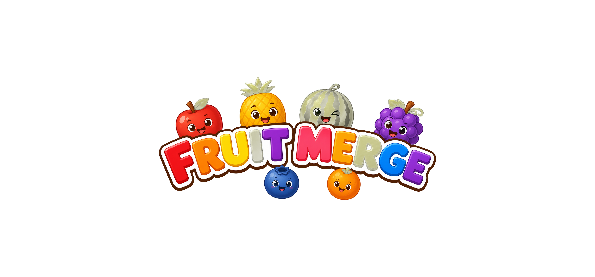
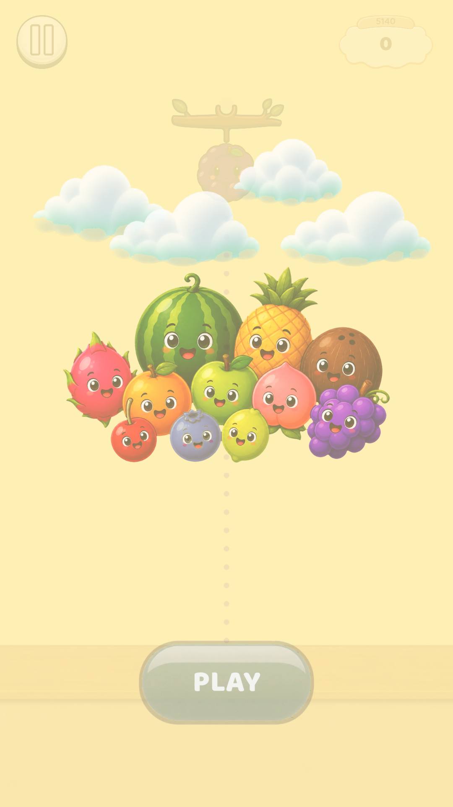
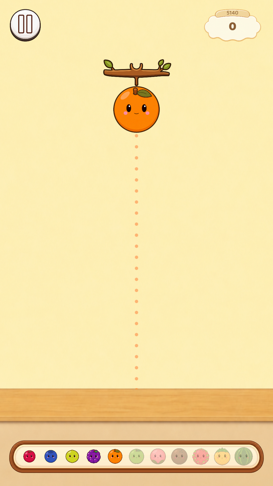
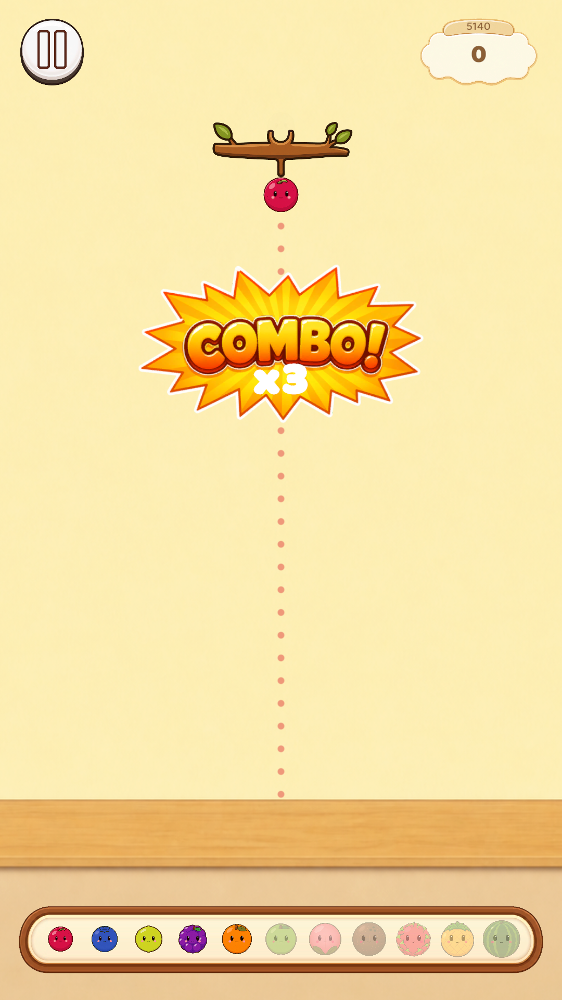
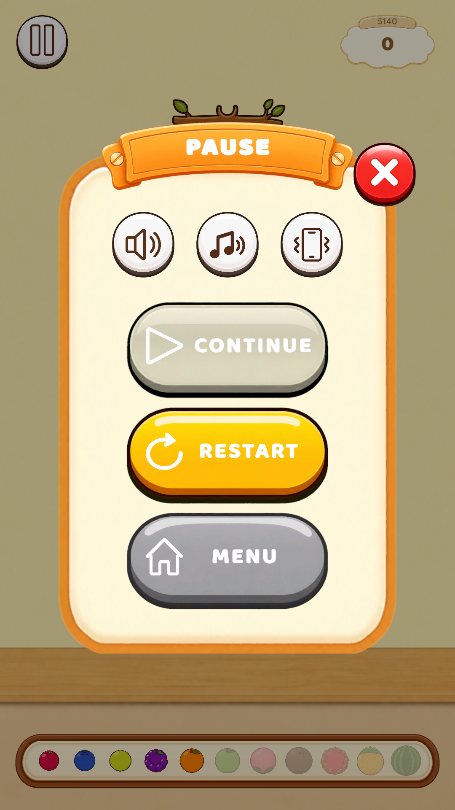

<p align="center">
  
</p>

<p align="center">
  Unity ile geliştirilen, Suika/2048 tarzında rahatlatıcı bir <b>meyve birleştirme</b> mobil oyunu.
</p>

---

## Oyun Hakkında

**Fruit Merge**'de amacın basit: kutunun üzerinden meyveleri bırakıyorsun, aynı türden iki meyve çarpıştığında bir üst tiere birleşip daha büyük bir meyveye dönüşüyor. Kutu ağzına kadar dolup taşarsa oyun bitiyor. Ne kadar çok ve zincirleme (**combo**) birleştirme yaparsan skorun ve kazandığın coin de o kadar artıyor.

Sakin müzikler, gülen yüzlü meyveler ve elle çizilmiş yumuşak bir görsel stille "tek elden bırakayım" dedirten, rahatlatıcı bir vakit geçirme oyunu.

### Öne Çıkan Özellikler

- 🍒 **11 farklı meyve tieri** — her birleşmede bir üst meyveye evrilen kademeli ilerleme
- ✨ **Combo zinciri** — art arda birleşmelerde ekranda patlayan "COMBO! xN" efektleri
- 🪙 **Coin ödül sistemi** — oyun sonunda skoruna göre coin kazanma
- 🐛 **Kurtçuk Boost'u** — hedef aldığın bir meyveyi kurtçukların yiyip yok etmesi
- 🌋 **Deprem Boost'u** — tahtayı sarsıp meyveleri yeniden düzenleyerek yer açma
- 💾 **Otomatik kayıt** — ilerlemen `save.json` ile cihazına şema sürümlü olarak kaydedilir
- 📳 **Ses, müzik ve titreşim** ayarları

### Meyve Tierleri

| # | Meyve | # | Meyve |
|---|-------|---|-------|
| 1 | 🍒 Kiraz | 7 | 🍑 Şeftali |
| 2 | 🫐 Yaban Mersini | 8 | 🥥 Hindistan Cevizi |
| 3 | 🍋 Misket Limonu | 9 | 🐉 Ejder Meyvesi |
| 4 | 🍇 Üzüm | 10 | 🍍 Ananas |
| 5 | 🍊 Portakal | 11 | 🍉 Karpuz |
| 6 | 🍏 Yeşil Elma | | |

İki tane Karpuz birleştirirsen... bir dahaki sürümde kim bilir ne çıkar. 😄

## Ekran Görüntüleri

<p align="center">
  
  
  
  
</p>

## Teknik Detaylar

- **Motor:** Unity `6000.0.80f1` — Universal Render Pipeline (2D)
- **UI:** UGUI + TextMeshPro
- **Mimari:** Merkezi bir statik olay yayın sistemi (`GameEvents`) üzerinden haberleşen, sorumlulukları `Core` / `Data` / `Gameplay` / `Services` / `UI` katmanlarına ayrılmış sistemler
- **Kayıt:** `PlayerPrefs` yerine `Application.persistentDataPath/save.json`, şema sürümlemesi ile geriye dönük uyumluluk

## Gereksinimler

- Unity **6000.0.80f1**
- Android/iOS build desteği (Unity Hub üzerinden ilgili platform modülleri kurulu olmalı)

## Kurulum

1. Bu depoyu klonlayın.
2. Unity Hub üzerinden projeyi açın (Unity `6000.0.80f1` sürümü ile).
3. Unity, gerekli paketleri (`Packages/manifest.json`) otomatik olarak indirecektir.

## Proje Yapısı

```
Assets/FruitMerge/
├── Scripts/
│   ├── Core/       # Oyun döngüsü, merkezi olay sistemi (GameEvents), boost altyapısı
│   ├── Gameplay/   # Meyve, birleşme mantığı, kurtçuk, drop kontrolcüsü
│   ├── UI/         # Paneller ve HUD bileşenleri
│   ├── Data/       # ScriptableObject veri tanımları (meyveler, ayarlar, yüzler)
│   └── Services/   # Ses, titreşim, kamera, efekt, kayıt ve boost yönetmenleri
├── Prefabs/
├── Art/
├── Audio/
├── Fonts/
└── Scenes/
```

## Lisans

Bu proje özel (private) bir projedir.
